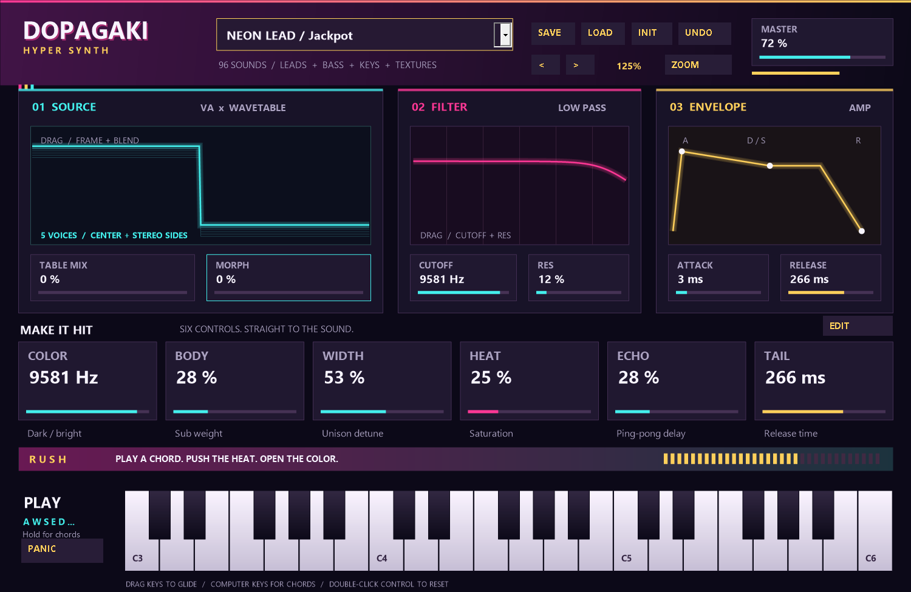

# dopagaki_synth

ネオン表示と普通の白鍵・黒鍵で試せる、オリジナルEDMシンセサイザーです。

Windows x64 VST3 / C++20 / MIT。現在は0.4.0開発版です。



## 主な機能

- 16ボイス、5ユニゾン、saw / pulse / sine / additive metal、サブオシレーター
- ウェーブテーブル、連続モーフ、frame motion、開始位相
- ADSR、共振ローパス、pitch impact、LFO filter wobble、トレモロゲート
- heat distortion、ステレオping-pong echo、出力ceiling
- 96オリジナルプリセット
- MIDIノート、ピッチベンド、CC1 wobble、CC64 sustain
- DAWパラメータ操作、状態保存、独自`.dopa`プリセット保存/読込
- SOURCE / FILTER / ENVELOPEの直接操作、ZOOM対応、37鍵キーボード

## ビルド

Visual Studio C++ desktop workload、Windows SDK、CMake 3.25以上が必要です。

```powershell
./tools/bootstrap.ps1
cmake -S . -B build -G "Visual Studio 18 2026" -A x64
cmake --build build --config Release --parallel
ctest --test-dir build -C Release --output-on-failure
python tools/package.py
```

生成物は`build/VST3/Release/dopagaki_synth.vst3`です。拡張子付きフォルダー全体をVST3フォルダーへ配置し、DAWで再スキャンしてください。

## 使い方

DAWのMIDIトラックに挿し、音色名をクリックしてプリセットを選びます。ノブや鍵盤はエディターから操作できます。詳細な操作・検証情報は`docs/`を参照してください。

本プロジェクトは開発中であり、全DAWでの動作保証や未実装機能の完成を意味しません。
